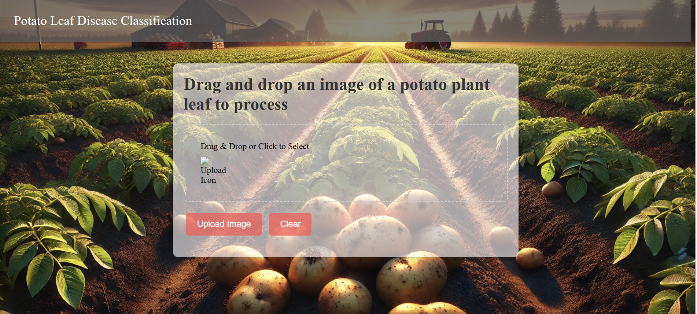
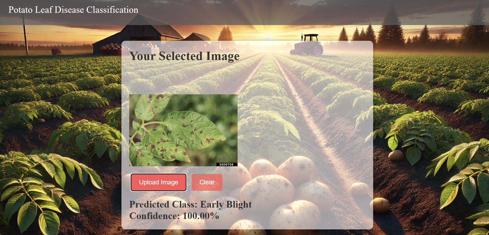
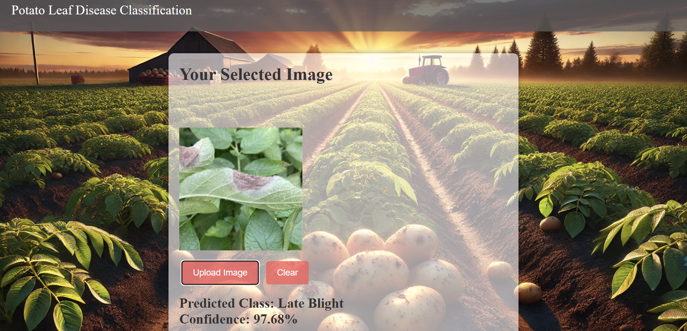

# Potato_Leaf_Disease_Classification-using-CNN
---
Farmers Growing Potato Plants face economic losses due to Two types of diseases. The First one is Early Blight Which is Caused by Fungi and the Second one is Late Blight Which is Caused by Some Specific Microorganisms the Early Detection of both Diseases is necessary for Early treatment as the treatment for both Diseases is different.
---
## Output

